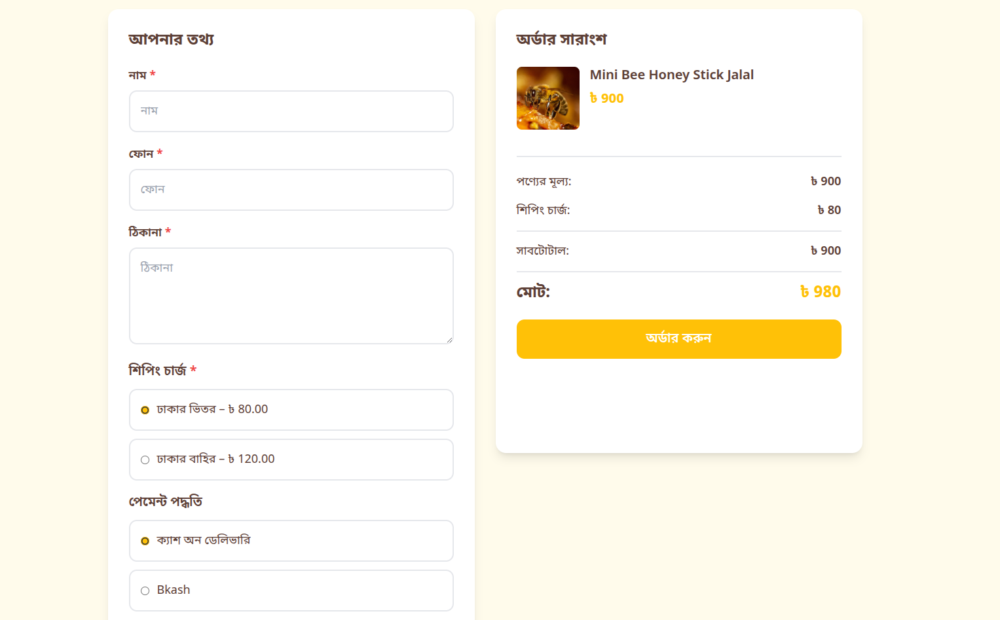

# MiniBeeBD - E-commerce & Landing Page Builder

A powerful, custom-built Laravel solution for comprehensive e-commerce management and dynamic landing page creation.

---

## 🚀 Key Features

### 🛒 E-Commerce Management
- **Product Catalog**: Advanced management for products, categories, subcategories, and brands.
- **Variation System**: Support for product variations (size, color, etc.) with dynamic pricing.
- **Order Flow**: Streamlined checkout process, automated order tracking, and status management.
- **Marketing Tools**: Integrated coupon system, discount management, and free shipping rules.
- **Combo Products**: Easily create and manage bundled product offerings.

### 🎨 Landing Page Builder
- **Custom Templates**: Specialized templates like the "Honey Landing Page" for high-conversion sales.
- **Section-Based Builder**: Flexible, JSON-powered content management for dynamic page sections.
- **Integrated Checkout**: Smooth, one-page checkout experience built directly into landing pages.
- **Preview & Management**: Admin interface to create, edit, and preview multiple landing pages.

### 🚚 Courier & Logistics Integration
- **Automated Fulfillment**: Direct integration with **Redx**, **Pathao**, and **Steadfast** for automated parcel creation.
- **Dynamic Logistics**: Real-time zone and area fetching for accurate delivery selection.
- **Status Sync**: Automated courier status updates for real-time order tracking.

### 📊 Admin Analytics & Security
- **Powerful Dashboard**: Real-time sales analytics, reports (order, product, user), and performance metrics.
- **Role-Based Access**: Granular permissions management using Spatie Laravel Permission.
- **Security Features**: Integrated IP blocking and fraud detection for phone numbers/orders.
- **Expense Tracking**: Manage business expenses directly within the admin panel.

## 📸 Screenshots




---

## 🛠 Technology Stack

- **Backend**: Laravel 10.x, PHP 8.x
- **Database**: MySQL / MariaDB
- **Frontend**: Blade Templates, Bootstrap 5, Sass, Vite
- **Integrations**: Stripe (Payments), Guzzle (API requests), Maatwebsite Excel (Reports)
- **Utilities**: Intervention Image (Image Processing), Spatie Permission (RBAC)

---

## ⚙️ Installation

### Prerequisites
- PHP >= 8.1
- Composer
- Node.js & NPM
- MySQL

### Setup Steps
1. **Clone the repository:**
   ```bash
   git clone https://github.com/shahjalal132/minibeebd-ecommerce-app.git
   cd minibeebd-ecommerce-app
   ```

2. **Install PHP dependencies:**
   ```bash
   composer install
   ```

3. **Install Frontend dependencies:**
   ```bash
   npm install && npm run build
   ```

4. **Environment Configuration:**
   ```bash
   cp .env.example .env
   php artisan key:generate
   ```

5. **Database Setup:**
   - Create a database and update `.env` with your credentials.
   ```bash
   php artisan migrate --seed
   ```

6. **Link Storage:**
   ```bash
   php artisan storage:link
   ```

7. **Serve the Application:**
   ```bash
   php artisan serve
   ```

---

## 📂 Directory Structure Highlights

- `app/Http/Controllers/Backend`: Core logic for admin management and landing page builder.
- `app/Http/Controllers/Frontend`: Logic for e-commerce storefront and user dashboard.
- `resources/views/templates`: Conversion-focused landing page templates.
- `app/Models/HoneyLandingPage.php`: Flexible model for JSON-powered landing pages.

---
